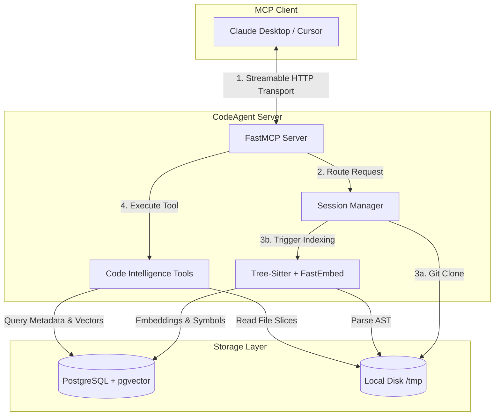

# 🚀 CodeAgent MCP

A powerful, hosted **Model Context Protocol (MCP)** server that gives LLMs (like Claude, Cursor, and Windsurf) the ability to understand, navigate, and query any public GitHub repository.

CodeAgent clones the repository, indexes it using **tree-sitter**, generates **local vector embeddings** via FastEmbed, and exposes a suite of advanced code-intelligence tools via **Streamable HTTP**.

---

## 🌟 Vision & What It Is

**The Problem:** LLMs are great at writing code, but they struggle to explore large codebases. Claude cannot hold a 500-file repository in context, nor can it efficiently build architecture diagrams or semantically search across thousands of functions natively.

**The Solution:** CodeAgent acts as the "eyes and hands" of the LLM with a 100% free, hosted backend.
1. The user tells the LLM: *"Index this GitHub repo"*
2. The LLM calls our `index_github_repo` tool.
3. CodeAgent clones the repo to disk, parses every file into an Abstract Syntax Tree (AST) using tree-sitter, generates **local embeddings (costing $0)** using CPU, and stores all functions, classes, and imports in a **PostgreSQL database**.
4. The LLM can now instantly generate **architecture diagrams**, perform **semantic vector searches**, and navigate the codebase precisely.

---

## 🏗 Architecture

Here is exactly how CodeAgent works under the hood:



### Components
- **FastMCP (Streamable HTTP):** The transport layer. Listens for HTTP requests at `/mcp` and maintains a streaming connection with the LLM.
- **Tree-Sitter + FastEmbed Indexer:** Scans the codebase, understands syntax (Python, JS, TS), extracts symbols, and generates local embeddings using the `BAAI/bge-small-en-v1.5` model (100% free, runs on CPU).
- **Postgres + pgvector:** Stores relational metadata and vector embeddings for lightning-fast semantic querying.

---

## 🛠 Available MCP Tools

CodeAgent equips the LLM with these exact capabilities:

| Tool | Description |
|---|---|
| `index_github_repo(github_url)` | Clones and indexes a public repo. Returns a unique `session_id`. |
| `generate_architecture_diagram(session_id)` | **[NEW]** Instantly returns a Mermaid.js class diagram of the entire repository's architecture. |
| `semantic_search_tool(query, session_id)` | **[NEW]** Uses `pgvector` to find code based on meaning (e.g., "password hashing logic") rather than exact keyword match. |
| `search_symbols(query, session_id)` | Finds functions/classes by partial name using fast `ILIKE` search. |
| `list_all_symbols(kind, session_id)` | Lists all symbols filtered by kind (e.g., all `class`es). |
| `find_callers_tool(function_name, session_id)` | Greps the codebase for places where a function is called. |
| `read_code(file_path, start_line, end_line, session_id)`| Reads exact source code lines directly from disk. |
| `get_imports(file_path, session_id)` | Lists all imports recorded for a specific file. |

---

## 🚀 Quick Start (Using the Hosted Version)

Want to try it immediately? Add our public hosted endpoint to your MCP client!

### Using Claude Desktop
1. Open Claude Desktop.
2. Go to **Settings (Gear Icon) → Connectors** (or Edit `claude_desktop_config.json`).
3. Click **Add Connector** → **Add Custom Connector** (or configure custom MCP HTTP endpoint).
4. Enter the Server URL: `https://codeagent-mcp.onrender.com/mcp`
5. Click **Connect**.

*Note: Claude Web (Chrome/Safari) does not support MCP yet. You must use the Claude Desktop macOS/Windows app.*

### Using Cursor
1. Go to **Cursor Settings → Features → MCP**.
2. Click **Add New MCP Server**.
3. Choose **Streamable HTTP / HTTP** as the transport.
4. Enter URL: `https://codeagent-mcp.onrender.com/mcp`

**Example "Mind-Blowing" Prompt:**
> "Index this repo: https://github.com/pallets/flask. Then, use the architecture tool to draw the complete class diagram. Finally, use semantic search to find where they handle request parsing."

---

## 💻 Self-Hosting & Deployment

CodeAgent is fully open-source and easy to host yourself. Because we use FastEmbed, **you do not need an OpenAI API key** to run semantic search.

### Prerequisites
- Python 3.11+
- PostgreSQL database (e.g., [Neon](https://neon.tech) free tier)
- Git installed on the system

### 1. Local Development Setup

```bash
# Clone the repository
git clone https://github.com/YOUR_USERNAME/CodeAgent-MCP.git
cd CodeAgent-MCP

# Create virtual environment and install
python3 -m venv .venv
source .venv/bin/activate
pip install -e .

# Configure environment
cp .env.example .env
# Edit .env and set your DATABASE_URL
```

Run the server locally:
```bash
python -m code_server.server
# Server will start at http://0.0.0.0:8000/mcp
```

### 2. Deploy to Railway or Render (Free Tier)
1. Push your code to GitHub.
2. Go to [Railway](https://railway.app) or [Render](https://render.com).
3. Create a new service from your GitHub repo.
4. Set the `DATABASE_URL` environment variable to your Postgres connection string.
5. Deploy! The platforms will automatically detect the `Dockerfile` and expose port `8000`.

---

## 🤝 Instructions for Contributors

We love contributions! If you want to make CodeAgent smarter, faster, or add support for more languages, here is how you can help:

### How to Contribute
1. **Fork the repo** and create your branch from `main`.
2. **Set up locally** using the *Local Development Setup* instructions above.
3. **Make your changes**. Ensure your code is well-commented and clean.
4. **Test your changes** by running the server locally and connecting your own Claude Desktop / Cursor to `http://localhost:8000/mcp`.
5. **Issue a Pull Request**.

### Areas to Improve (Ideas for PRs)
- **Add Language Support:** Currently, we parse Python, JS, and TS. Help us add Go, Rust, Java, or C++ by updating the `indexer.py` tree-sitter grammars!
- **Autonomous Cloud PRs:** Add WRITE capabilities (`edit_file`, `create_pull_request`) so Claude can act as an autonomous SWE-agent on GitHub repos without needing a local dev environment.
- **Smarter Chunking:** Improve how `read_code` returns large files so the LLM context window doesn't get flooded.
- **Dependency Health API:** Use OSV.dev and PyPI APIs to scan the repo's dependencies for security vulnerabilities and output an automated health check.

### Development Guidelines
- All DB-touching functions live in `code_server/tools.py` and must accept a `session_id`.
- Tool wrappers for FastMCP live in `code_server/server.py`.
- We use `asyncpg` for database pooling. **Never** use blocking synchronous calls in the async event loop (use `asyncio.to_thread` for CPU-heavy tasks like embeddings).

---

## 📄 License

This project is licensed under the MIT License - see the LICENSE file for details.
